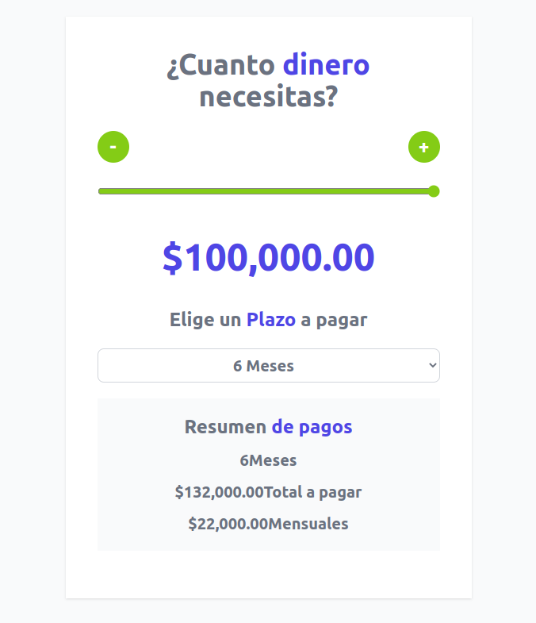

# Cotizador de Prestamos

## Descripción

### Calculadora para cotizar prestamos hecho con `React` , `Vite` , `Tailwind`. En la barra puedes elegir mas o menos dinero necesitas , escojer un plazo para pagar en meses.

## Uso

### Calcular cuanto debes de pagar en intereses mensuales depediendo de la cantidad de dinero que necesitas y el plazo en meses que eligas.

## Deployme

[Netlify](https://nimble-jelly-6e6a34.netlify.app/)

 